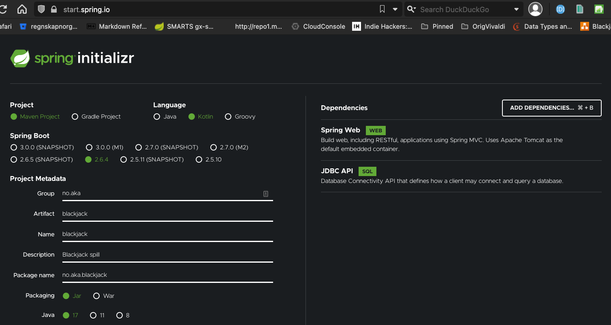

# BlackJack Spring Boot versjon
Dette er besvarelsen til øvingsoppgave nivå4 (Database) i utviklingsløpet til Decisive.
Løsningen på denne oppgaven er skrevet i Kotlin.

## Oppsett Spring Boot Kotlin 
Dette prosjektet ble generert fra https://start.spring.io valgene som bildet nedenfor viser.
Initielt ble det gjort noen tilpasninger i tillegg
* Kopiert application.yml fra [nivå 4 løsningen](https://github.com/akaabel/blackjack/blob/niva4-simpel/src/main/resources/application.yml)
til Blackjack java versjonen
* H2 database support
* Postgresql
* Flyway
* Noen modifikasjoner på [.gitignore](.gitignore)

## Hvordan spille
Følgende endepunkter benyttes for å spilles spillet.

### `/start` og `/startjson` 
Starter et nytt spill. Man angir spillerens navn ved en POST operasjon.

Dette kan gjøres med JSON:
`curl -X POST localhost:8080/startjson -H 'Content-type:application/json' -d '{"spillernavn": "Alf-Kenneth Aabel"}' | jq`

Eller man kan bare POSTe navnet, slik:
`curl -X POST localhost:8080/start -H 'Content-type:application/json' -d "Alf-Kenneth Aabel" | jq`

### `/vis`
Viser spillets status.

### `/trekk`
Trekk et nytt kort. Spilleren kan trekke så lenge verdien av hånden ikke overstiger 21.
Dersom håndens verdi er mer enn 21, kastes en Exception. Da må man starte spillet på nytt.

### `/pass`
Stå og ikke trekk flere kort. Dealer spiller da sitt spill og resultatet vises.

## Testing
Testing av applikasjonen er gjort ved unit- og komponenttester.

## Persistering og database

### Mulig måter å installere Postgres på

#### Docker
For å installere og starte en Postgres database med docker trenger man bare kjøre en kommando:

`docker run --name blackjack_db -p 5432:5432 -d postgres`

#### docker-compose
For å starte Postgresql med docker-compose, se [Makefile](./Makefile).

### Nyttige kommandoer for Postgres
1. Koble til psql: `docker exec -it postgres psql -U postgres`.
   1. Se databaser i psql: `\l` eller `select * from pg_database;`
   2. Bytt database: f.eks. `\c blackjack`, eller logg direkte på med `docker exec -it postgres psql -U postgres -d blackjack`. 
   3. Vis tabeller: `\dt`, alternativt `SELECT * FROM pg_catalog.pg_tables WHERE schemaname != 'pg_catalog' AND schemaname != 'information_schema';` 

